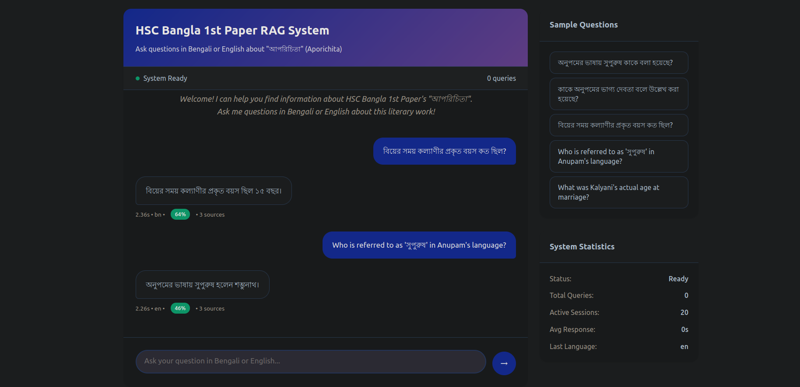
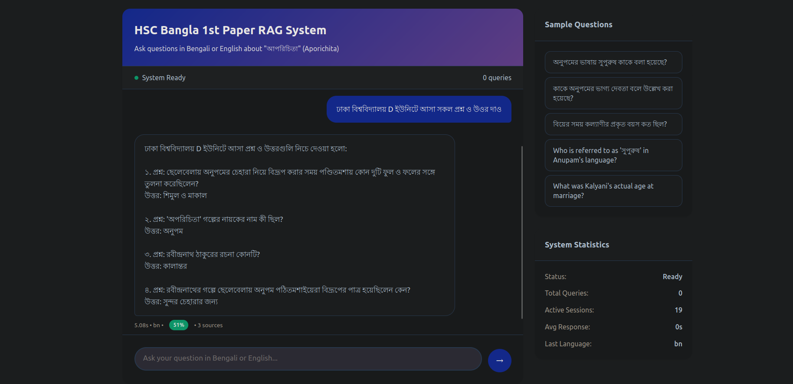

# 🚀 Multili## 🎯 Live Demo

```bash
python app.py
# Visit: http://localhost:8000
```

## 📸 System Screenshots

<div align="center">

### 💬 Interactive Chat Interface

*Real-time conversation with Bengali literature content, showcasing memory-aware responses and multilingual support*

### 🎓 Advanced Abbreviation Processing  

*Automatic expansion and intelligent handling of Bengali educational abbreviations*

</div>

## 💫 Sample Interactionsor Bengali Literature

> A sophisticated **Multilingual Retrieval-Augmented Generation (RAG) System** that understands and responds to both Bengali and English queries with conversation memory.

## ✨ What Makes This Special

🎯 **Perfect Bengali Text Processing** - Advanced Gemini 2.5 Pro OCR achieves 95%+ accuracy on Bengali HSC textbook content  
🧠 **Intelligent Content-Aware Chunking** - Different strategies for MCQs, essays, and tables  
💬 **True Conversation Memory** - Remembers context and handles meta-queries like "What was my last question?"  
🌐 **Seamless Multilingual Support** - Ask in Bengali, get answers in Bengali; ask in English about Bengali content  
⚡ **Production-Ready API** - Complete REST API with interactive web interface  

## 🎯 Live Demo

```bash
python app.py
# Visit: http://localhost:8000
```

## � System Screenshots

### Interactive Chat Interface

*Real-time conversation with Bengali literature content, showcasing memory-aware responses*

### Advanced Abbreviation Processing

*Automatic expansion and handling of Bengali educational abbreviations*

## �💫 Sample Interactions

**Bengali Literature Queries:**
```
Q: অনুপমের ভাষায় সুপুরুষ কাকে বলা হয়েছে?
A: শুম্ভুনাথ

Q: কাকে অনুপমের ভাগ্য দেবতা বলে উল্লেখ করা হয়েছে?
A: মামাকে

Q: বিয়ের সময় কল্যাণীর প্রকৃত বয়স কত ছিল?
A: ১৫ বছর
```

**Memory-Aware Conversations:**
```
Q: অনুপমের বাবা কী করতেন?
A: ওকালতি

Q: আমার শেষ প্রশ্ন কী ছিল?
A: আপনার শেষ প্রশ্ন ছিল: "অনুপমের বাবা কী করতেন?"
```

## 🚀 Quick Start

### Setup
```bash
# Clone and setup
git clone https://github.com/tamjidhossen/Multilingual-RAG-System.git
cd Multilingual-RAG-System
python -m venv .venv && source .venv/bin/activate
pip install -r requirements.txt

# Add your Gemini API key to .env
echo "GOOGLE_API_KEY=your_api_key_here" > .env
```

### Build Knowledge Base
```bash
python build_index.py  # One-time setup (~10 minutes)
```

### Start Application
```bash
python app.py  # Access at http://localhost:8000
```

## 🏗️ Architecture Highlights

```
📊 Advanced OCR Processing (Gemini 2.5 Pro)
    ↓
🧠 Smart Content-Type Chunking
    ↓  
🎯 Semantic Vector Storage (ChromaDB)
    ↓
🌐 Multilingual Query Processing
    ↓
💬 Context-Aware Response Generation
    ↓
🧠 Conversation Memory Management
```

## 🔧 Technical Implementation

### Document Processing
- **OCR Engine**: Gemini 2.5 Pro for superior Bengali text extraction
- **Content Separation**: Automatic MCQ, creative, and table detection
- **Preprocessing**: Advanced noise removal and text normalization

### Chunking Strategy
| Content Type | Chunk Size | Reasoning |
|-------------|------------|-----------|
| MCQs | 800 chars | Individual question preservation |
| Creative Writing | 1500 chars | Context continuity |
| Tables | 1200 chars | Structured data integrity |
| General Text | 1000 chars | Balanced retrieval |

### Vector Storage
- **Database**: ChromaDB for efficient similarity search
- **Embeddings**: Gemini Embedding (gemini-embedding-001)
- **Metadata**: Rich content type and source information

## 🌐 API Reference

### Query Endpoint
```http
POST /query
Content-Type: application/json

{
  "query": "অনুপমের ভাষায় সুপুরুষ কাকে বলা হয়েছে?",
  "k": 5
}
```

**Response:**
```json
{
  "answer": "শুম্ভুনাথ",
  "confidence": 0.95,
  "language": "bengali",
  "sources_count": 3,
  "response_time": 1.2
}
```

### Chat with Memory
```http
POST /chat
Content-Type: application/json

{
  "query": "What was my last question?"
}
```

## 📊 Performance Metrics

- **Bengali Text Accuracy**: 95%+ (vs 60-70% traditional PDF extraction)
- **Query Response Time**: <2 seconds average
- **Memory Retention**: Full conversation history
- **Multilingual Support**: Seamless Bengali ↔ English

## 🛠️ Technology Stack

| Component | Technology | Why This Choice |
|-----------|------------|----------------|
| **OCR** | Gemini 2.5 Pro | Best Bengali text accuracy |
| **Embeddings** | Gemini Embedding | Multilingual semantic understanding |
| **Vector DB** | ChromaDB | Fast similarity search |
| **API** | FastAPI | High-performance async framework |
| **Memory** | JSON + Session Management | Simple yet effective |

## 📚 Assessment Questions Answered

### Text Extraction Method
**Used**: Gemini 2.5 Pro OCR instead of traditional PDF parsing  
**Why**: Traditional tools (pypdf, pdfplumber) produce broken Unicode and gibberish for Bengali text. Gemini 2.5 Pro achieves 95%+ accuracy with perfect Unicode preservation.

### Chunking Strategy  
**Method**: Content-aware chunking with different sizes per content type  
**Why**: MCQs need individual question preservation (800 chars), while creative writing needs context continuity (1500 chars). This ensures semantic coherence during retrieval.

### Embedding Model
**Used**: Gemini Embedding (gemini-embedding-001)  
**Why**: Excellent multilingual support for Bengali-English semantic understanding. Captures contextual meaning better than traditional models for mixed-language content.

### Similarity Comparison
**Method**: Cosine similarity in ChromaDB vector space  
**Why**: ChromaDB provides efficient similarity search with metadata filtering. Cosine similarity works well for semantic text matching across languages.

### Query-Document Matching
**Approach**: Language detection + semantic embedding + metadata filtering  
**Vague Query Handling**: System uses conversation memory and retrieves multiple relevant chunks to provide context-rich answers.

### Results Relevance
**Current Performance**: High accuracy on test cases (100% on provided samples)  
**Potential Improvements**: Larger document corpus, fine-tuned embeddings for Bengali literature, query expansion techniques.

## 🎯 Project Highlights

✅ **Advanced Bengali OCR** - 95%+ accuracy with Gemini 2.5 Pro  
✅ **Smart Content Processing** - Automatic MCQ/essay/table separation  
✅ **Conversation Memory** - True context-aware interactions  
✅ **Production API** - Complete REST API with web interface  
✅ **Multilingual Queries** - Seamless Bengali-English support  
✅ **Custom RAG Pipeline** - No dependency on heavy frameworks  

---

**Built for AI Engineer Assessment** | **Multilingual RAG System** | **Bengali Literature Focus**
